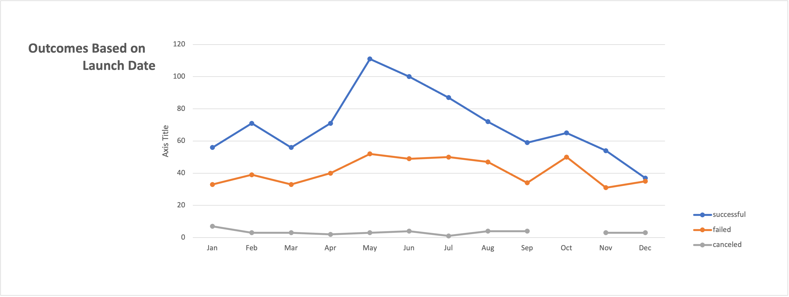
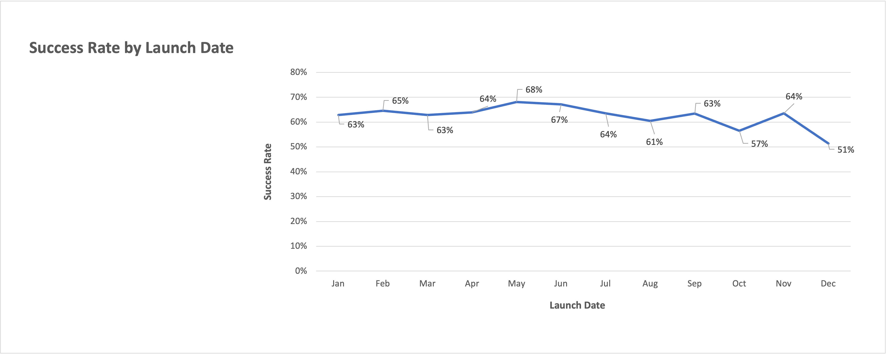
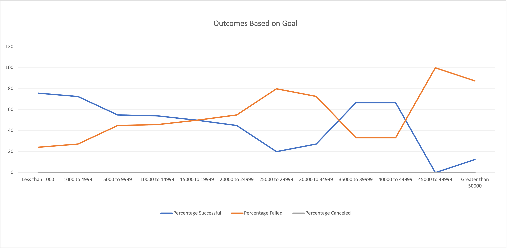
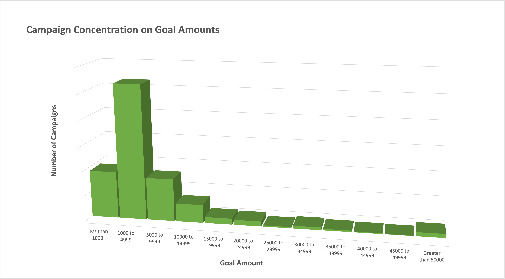
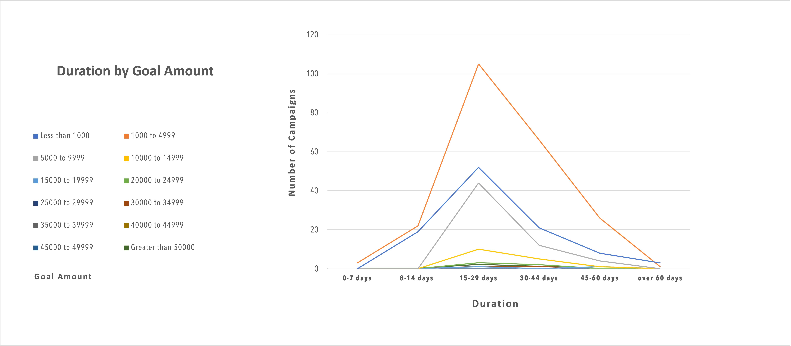
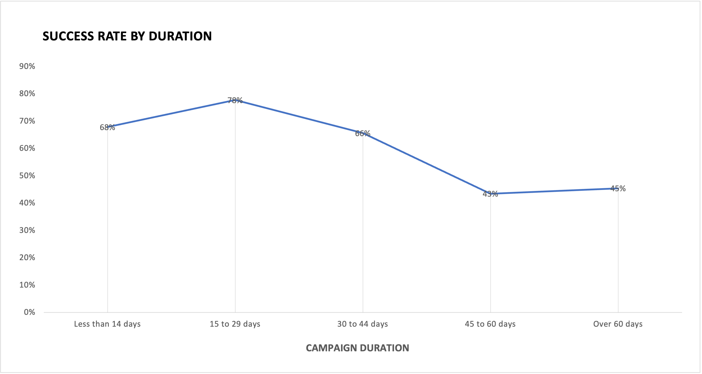

# kickstarter_ANALYSIS

## Purpose
The purpose of this project is to provide insight on how the launch date and the goal amount of a crowdfunding campaign for theater affects its outcome.  

## **Analysis and Challenges**

### **Analysis of Outcomes Based on Launch Date**
To analyze outcomes based on launch date I created a pivot table that provided me with total numbers of succesful, failed and canceled campaigns for each month of the year. From this pivot table I created a line chart to visualize the change overtime. From that pivot table I drew data to create another table to calculate mean and median values of campaign success rate based on launch date. 

### **Analysis of Outcomes Based on Goals**
To analyze outcomes based on goals I created a new table and populated its cells using the COUNTIFS function. I then calculated the percentage of successful and failed campaigns. Using this table I created a line chart to visualize how successful campaigns are as the goal amount rises. 

This chart indicated an anomaly and to confirm it I created a column graph to highlight the huge concentration of campaigns in the lowest goal amounts. 

### **Challenges and Difficulties Encountered**
The greatest challenge was the imbalance of campaigns throughout the goal amount field. I had to decide whether I could treat all data for amounts greater than 30K as outliers.  

# **Results**

## **Outcomes based on Launch Date**

  As we see in the graph there is parallel motion of both lines until they break apart in May to align again in August and to the end of the year. The margin increase between successful and failed lines combined with the increase in total campaigns translates to an increase in the success rate in late spring which holds for most of the summer. This indicates **late spring and the first two thirds of the summer as the optimal period to start a campaign**. As we move to the end of the summer success rates gradually fall and the margin between successful campaigns and failed is again locked in the initial parallel motion.  

We can verify this trend by taking in mind that most theatre projects require four to six months of planning, production and rehearsals. It is thus expected that more campaigns will start in late spring and early summer as they probably aim to conclude early in the summer and premier in Fall. 

It is important to mention that although the number of campaigns created rises naturally in May due to the aforementioned circumstances, the success rate also jumps by 5% which is the second biggest month to month increase. The biggest increase is observed from October to November where there is a 7% increase followed by a steep drop of 13% in December. This may represent a second wave of productions that aim to premier in the spring as well as **seasonal bias** for each outcome. People tend to be more optimistic, extrovert and generous in the spring but more preoccupied with matters of their own at the end of the year when they also tend to spend more money in gifts and outings. 

In the second graph we examine success rate based on launch date throughout the year. It is evident that **the first half of the year is more favorable for crowdfunding**. By calculating the median for each half of the year we notice a 2% drop from first to second half. 

 

## **Outcomes based on Goals**

Observing the Outcomes based on Goals graph can be a real journey. As one would expect, we see a high concentration of successful campaigns in the low goal ranges of up to $10K. Then what follows is a natural and steady decline as the goal amounts rise. When we move past $30K this changes and we see the two lines trading places for a brief moment for amounts from $35K to $45K, before the successful line drops again in a real dramatic fashion. 

As displayed in the graph above this anomaly is caused by a huge concentration of campaigns in the lower goal amounts. This is to be expected as projects with more ambitious goal amounts in excess of $30K would probably turn to other types of fundraising. 

## **Outcomes based on Duration**
A welcoming addition to the already drawn conclusions could be provided by entering **duration** as a variable. Creating a new column on the spreadsheet, I subtracted *End Date Conversion* from *Launch Date Conversion* to count the days each campaign lasted. From this data I created a new table that includes goal amounts and duration to completion data. From this table we draw two more charts to display the relationship between Goal Amount and Duration as well as the Success Rate for each duration range. 

From these we conclude it takes most succssful campaigns 30 days to reach their goal. Extending the campaign to 45 or 60 days will not bring in higher amounts. To support this we have to examine what was the duration for the high goal campaigns

## **Limitations**
This dataset needs **further branching under the play subcategory**. There are different factors within a theatre production that will affect the success of its crowdfunding campaign such as the specific genre and theme, indoor or outdoor production, and the one absolutely intangible variable; the vision each production has for the message it is carrying. This specific variable can be deciding and can make all the rest seem superficial. 

Another limitation is **the specifics on canceled campaigns**. Because we do  not know the reason for the cancelations, we cannot include them when calculating averages. We do not know if a specific campaign was canceled because those running it realized they will never reach their goal or because of some random circumstance that forced them to this decision. If, for example, a campaign is canceled before its end date because it wasn't reaching its goal, then it should normally be counted as a failed campaign. 
